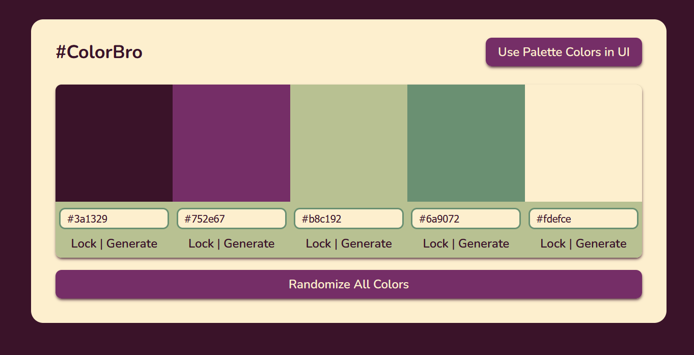

[COLORBRO](https://santten.github.io/color-bro/) is a color generator web app that is sure to give you an awesome 5-color palette for your next project...!!

#### features as of v. 1.0.0 (30.9.2024)
- "Randomize All Colors" button 
- but also allows randomizing only one color of choice
- lock colors you want to prevent from randomizing along with "Randomize All Colors"
- ability to switch UI to use the current active palette
- fine-tune your color choices by a text input field that lets you change the hex code manually